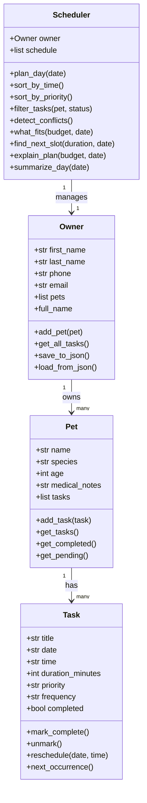

# PawPal+ 🐾

A pet care planner built with Python and Streamlit. You add your pets, schedule their care tasks, and the app figures out what actually fits in your day — and tells you why it skipped anything it couldn't fit.

---

## Scenario

A busy pet owner wants to stay on top of their pet's care without having to mentally juggle everything. They need something that can:

- Keep track of care tasks like walks, feeding, meds, grooming, vet visits
- Work around how much time they actually have that day
- Give them a realistic plan, not just a list of everything

---

## Features

### Core
- **Register pets** — add multiple pets with species, age, and medical notes
- **Book appointments** — schedule care tasks with date, time, duration, priority, and repeat frequency
- **Mark as done** — confirm appointments and auto-book next occurrence for recurring tasks

### Smarter Scheduling
- **Sort by time** — view the day's appointments in chronological order
- **Sort by priority** — reorder appointments high → medium → low so critical tasks surface first
- **Time budget filter** — enter your available minutes and the planner picks the highest-priority tasks that fit using a greedy algorithm
- **Conflict detection** — automatically flags two appointments booked at the same date and time with a warning
- **Explain my plan** — plain-English breakdown of every included and skipped task, and why
- **Next available slot** *(Challenge 1)* — given a task duration, scans the day in 15-minute increments and returns the first time window with no overlapping appointments
- **Data persistence** *(Challenge 2)* — all pets and appointments are saved to `data.json` after every change and reloaded automatically on next launch
- **Priority color-coding** *(Challenge 3)* — 🔴 High / 🟡 Medium / 🟢 Low visual indicators throughout the UI and CLI tables
- **Task type emojis** *(Challenge 4)* — 🦮 walks, 🍽️ feedings, 💊 medications, 🏥 vet visits, 🎾 play, and more, automatically assigned from the appointment title

### How Agent Mode Was Used (Challenge 1)
I used Agent Mode to build `find_next_slot()`. My prompt was something like:

> "Add a `find_next_slot(duration_minutes, target_date, start_hour)` method to Scheduler that scans the day in 15-minute increments and finds the first open time slot for a task of that length, without overlapping anything already booked."

The first version it came back with only checked if start times matched, which would've missed cases where a new appointment starts in the middle of an existing one. I pointed that out and it rewrote it with proper interval overlap logic — if two intervals `[s1, e1]` and `[s2, e2]` overlap when `s1 < e2 and s2 < e1`. That version actually works correctly so I kept it.

---

## System Architecture

```
Owner  ──owns──►  Pet  ──has──►  Task
                                          ▲
Scheduler  ──manages──►  Owner           │
  • plan_day()                            │
  • sort_by_time()          next_occurrence() (recurring)
  • sort_by_priority()
  • what_fits(budget)
  • find_conflicts()
  • explain_plan(budget)
```

### Classes

| Class | Role |
|---|---|
| `Owner` | The pet owner — name, contact info, list of pets |
| `Pet` | Stores pet info and a list of care tasks |
| `Task` | A single care activity — time, duration, priority, frequency |
| `Scheduler` | The brain — sorts, filters, detects conflicts, explains plans |

---

## Getting Started

```bash
python -m venv .venv
source .venv/bin/activate   # Windows: .venv\Scripts\activate
pip install -r requirements.txt
streamlit run app.py
```

---

## Testing PawPal+

```bash
python -m pytest
```

The test suite covers 22 behaviors across 7 categories:

| Category | What's tested |
|---|---|
| Task lifecycle | mark_complete, unmark, reschedule |
| Recurrence | daily (+1 day), weekly (+7 days), none |
| Pet management | task count, completed, pending |
| Sorting | by time (chronological), by priority (high→low) |
| Conflict detection | same time flagged, different times pass |
| what_fits | budget cap, priority preference, zero budget |
| explain_plan | INCLUDED/SKIPPED labels, conflict mentions |

**Confidence: ★★★★☆** — everything core works. The one thing I'd add tests for next is overlapping durations (e.g. a 30-min task at 7:00 and a 20-min task at 7:15 — those overlap but the conflict detector doesn't catch them yet).

---

## 📸 Demo


---

## UML Diagram


