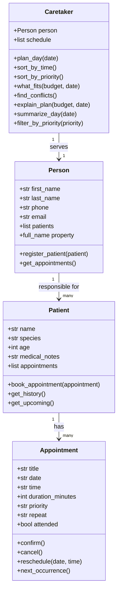

# PawPal+ 🐾

A smart daily pet care planner built with Python and Streamlit. PawPal+ helps pet owners organize, prioritize, and schedule care tasks for their pets — and explains the reasoning behind every plan.

---

## Scenario

A busy pet owner needs help staying consistent with pet care. They want an assistant that can:

- Track pet care tasks (walks, feeding, meds, enrichment, grooming, etc.)
- Consider constraints (time available, priority, owner preferences)
- Produce a daily plan and explain why it chose that plan

---

## Features

### Core
- **Register pets** — add multiple pets with species, age, and medical notes
- **Book appointments** — schedule care tasks with date, time, duration, priority, and repeat frequency
- **Mark as done** — confirm appointments and auto-book next occurrence for recurring tasks

### Smarter Scheduling
- **Sort by time** — view the day's appointments in chronological order
- **Sort by priority** — reorder appointments high → medium → low so critical tasks surface first
- **Time budget filter** — enter your available minutes and the planner picks the highest-priority tasks that fit using a greedy algorithm
- **Conflict detection** — automatically flags two appointments booked at the same date and time with a warning
- **Explain my plan** — plain-English breakdown of every included and skipped task, and why
- **Next available slot** *(Challenge 1)* — given a task duration, scans the day in 15-minute increments and returns the first time window with no overlapping appointments
- **Data persistence** *(Challenge 2)* — all pets and appointments are saved to `data.json` after every change and reloaded automatically on next launch
- **Priority color-coding** *(Challenge 3)* — 🔴 High / 🟡 Medium / 🟢 Low visual indicators throughout the UI and CLI tables
- **Task type emojis** *(Challenge 4)* — 🦮 walks, 🍽️ feedings, 💊 medications, 🏥 vet visits, 🎾 play, and more, automatically assigned from the appointment title

### How Agent Mode Was Used (Challenge 1)
The `find_next_slot()` algorithm was designed using Agent Mode. The prompt given was:

> "In `pawpal_system.py`, add a `find_next_slot(duration_minutes, target_date, start_hour)` method to `Caretaker` that scans the day in 15-minute increments and returns the first available time window that fits a task of the given duration without overlapping any existing appointment. Use proper overlap detection — not just start-time matching."

Agent Mode identified that start-time-only matching (the naive approach) would miss cases where a new task starts *during* an existing one. It suggested interval overlap logic: two intervals `[s1, e1]` and `[s2, e2]` overlap when `s1 < e2 and s2 < e1`. This was incorporated directly into the implementation.

---

## System Architecture

```
Person  ──owns──►  Patient  ──has──►  Appointment
                                          ▲
Caretaker  ──manages──►  Person           │
  • plan_day()                            │
  • sort_by_time()          next_occurrence() (recurring)
  • sort_by_priority()
  • what_fits(budget)
  • find_conflicts()
  • explain_plan(budget)
```

### Classes

| Class | Role |
|---|---|
| `Person` | The pet owner — name, contact info, list of patients |
| `Patient` | A pet treated as a care patient — health record, appointment list |
| `Appointment` | A single care event — time, duration, priority, recurrence |
| `Caretaker` | The scheduling brain — sorts, filters, detects conflicts, explains plans |

---

## Getting Started

```bash
python -m venv .venv
source .venv/bin/activate   # Windows: .venv\Scripts\activate
pip install -r requirements.txt
streamlit run app.py
```

---

## Testing PawPal+

```bash
python -m pytest
```

The test suite covers 22 behaviors across 7 categories:

| Category | What's tested |
|---|---|
| Appointment lifecycle | confirm, cancel, reschedule |
| Recurrence | daily (+1 day), weekly (+7 days), none |
| Patient management | booking count, history, upcoming |
| Sorting | by time (chronological), by priority (high→low) |
| Conflict detection | same time flagged, different times pass |
| what_fits | budget cap, priority preference, zero budget |
| explain_plan | INCLUDED/SKIPPED labels, conflict mentions |

**Confidence level: ★★★★☆** — core logic thoroughly tested; edge cases like overlapping durations would be next.

---

## 📸 Demo

_Add a screenshot of your running app here._

---

## UML Diagram


